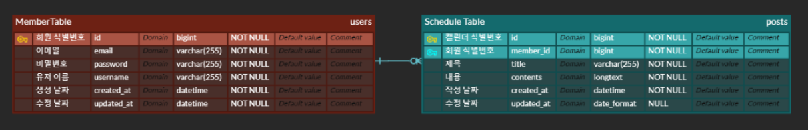

# Calendar Project 📅

## 프로젝트 소개 💻

간단한 일정 관리 웹 애플리케이션으로, Spring Framework의 기초를 학습하고 실습하기 위한 프로젝트입니다.

## 개발 기간 🕰️

- 2025.03.27 목 - 2025.04.04 금

## 프로젝트 목적 🎯

- Spring Framework 기본 기능 학습
- JPA를 이용한 설계 및 구현 연습
- 일정 관리 시스템의 기본 기능 구현

---

## 🛠 **사용 기술 스택**

| 분야 | 기술 |
|------|------|
| **언어** | Java 17 |
| **프레임워크** | Spring Boot 3.x, Spring Data JPA |
| **데이터베이스** | MySQL (운영용 고려 가능) |
| **ORM** | JPA (Hibernate) |
| **빌드 도구** | Gradle |
| **보안 및 인증** | Session 기반 로그인 |
| **문서화** | Postman (추가 가능) |
| **IDE** | IntelliJ IDEA |
| **버전 관리** | Git, GitHub |

---

필요하다면 "배포 환경", "협업 도구", "라이브러리" 같은 서브 섹션도 더 넣을 수 있어요. 원해? 😎
---

# 📌 **Schedule API 문서**

## 📝 **게시글 관련 API**
| 기능 | 메서드 | 엔드포인트 | 요청 예시 | 설명 |
|------|------|------------|-----------|------|
| 🆕 스케줄 생성 | `POST` | `/schedule` | `{ "title": "과제 제출1", "contents": "끝내고 제출1" }` | 새로운 스케줄을 생성합니다. |
| 📋 스케줄 전체 조회 | `GET` | `/schedule` | 없음 | 등록된 모든 스케줄을 조회합니다. |
| 🔍 특정 게시글 조회 | `GET` | `/schedule/{id}` | 없음 | 특정 ID의 게시글을 조회합니다. |
| ✏️ 게시글 수정 | `PATCH` | `/schedule/{id}` | `{ "title": "수정된 제목", "contents": "수정된 내용" }` | 특정 ID의 게시글을 수정합니다. |
| ❌ 게시글 삭제 | `DELETE` | `/schedule/{id}` | 없음 | 특정 ID의 게시글을 삭제합니다. |

---

## 👤 **회원 관련 API**
| 기능 | 메서드 | 엔드포인트 | 요청 예시 | 설명 |
|------|------|------------|-----------|------|
| 📝 회원가입 | `POST` | `/members/signup` | `{ "username": "test1", "password": "1234", "email": "she@gmail.com" }` | 새로운 회원을 등록합니다. |
| 🔍 특정 회원 조회 | `GET` | `/members/{id}` | 없음 | 특정 ID의 회원 정보를 조회합니다. |
| ✏️ 회원 수정 | `PUT` | `/members/{id}` | `{ "username": "신은주", "email": "suj9810@naver.com", "password": "1234" }` | 특정 회원 정보를 수정합니다. |
| ❌ 회원 탈퇴 | `DELETE` | `/members/{id}` | `{ "password": "1234" }` | 특정 ID의 회원을 탈퇴시킵니다. |

---

## 🔐 **로그인 API**
| 기능 | 메서드 | 엔드포인트 | 요청 예시 | 설명 |
|------|------|------------|-----------|------|
| 🔑 로그인 | `POST` | `/login` | `{ "email": "she@gmail.com", "password": "1234" }` | 이메일과 비밀번호로 로그인합니다. |

---

## 개발 단계 🚀

### Lv.0: 설계 및 계획
- API 명세서 작성
- ERD 설계
- SQL 쿼리 준비

### Lv.1: 일정 CRUD

- 일정 생성
- 전체 일정 조회
- 개별 일정 조회
- 일정 수정
- 일정 삭제

### Lv.2: 유저 CRUD

- 특정 회원 조회
- 회원 수정
- 회원 탈퇴

### Lv.3: 회원가입

- 회원가입

### Lv.4: 로그인 인증

- 로그인(Session 구현)

## 추가 정보 ℹ️

- SQL 스크립트는 [schedule.sql](schedule.sql)
- ERD 다이어그램: 